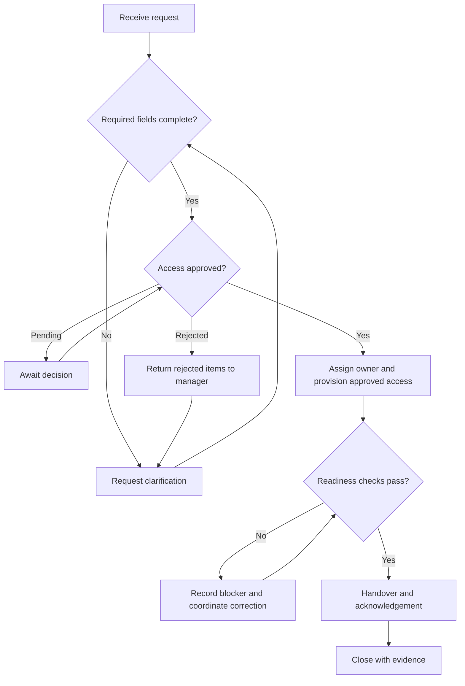

# Process analysis

Independent simulation. The current state is an assumed scenario, not an observed employer process.

## Assumed current state
A manager emails IT with partial details. IT requests clarification, coordinates access and equipment separately, and relies on informal confirmation that everything is ready. This could create rework, unclear ownership, and incomplete handover evidence.

## Proposed future state

## Handoffs and status rules
| Stage | Owner | Output / gate |
| --- | --- | --- |
| Intake | Manager, supported by IT | Complete request, or Pending clarification (BR-01) |
| Approval | Application owner | Recorded decision for each application (BR-02) |
| Coordination | IT support | Assigned owner and tracked tasks (BR-03) |
| Provisioning | Authorized support resource | Approved access only (BR-04) |
| Validation | IT support | Recorded readiness results (BR-05) |
| Blocker handling | Support owner with relevant team | Correction, next update, and visible impact (BR-06) |
| Handover | Support and employee | Acknowledgement and support instructions (BR-07) |
| Reporting | Service owner | Aggregated process measures (BR-08) |

## Exceptions
- **Urgent request:** communicate impact and escalate prioritization; retain approval gates.
- **Partial access approval:** track each item separately; leave rejected or pending items unprovisioned. This draft assumes all requested items must be resolved before closure; validate whether partial handover is acceptable.
- **Device unavailable:** record blocker and owner; do not mark readiness complete.
- **Duplicate request:** investigate before merging or cancelling; preserve audit history and notify requester.
- **Changed employee role:** obtain a revised approval and repeat the access comparison.
- **Employee unavailable:** retain Awaiting handover status; assign a follow-up action.

## Alternatives considered
1. Keep email intake: simplest, but weak structured validation and tracking.
2. Use a shared tracker: suitable for a synthetic prototype; production access controls and auditability need evaluation.
3. Use an ITSM request form and tasks: proposed longer-term option, subject to tool capability, cost, and stakeholder validation.

The recommendation is a tool-neutral controlled workflow; this project does not implement ServiceNow or another platform.
